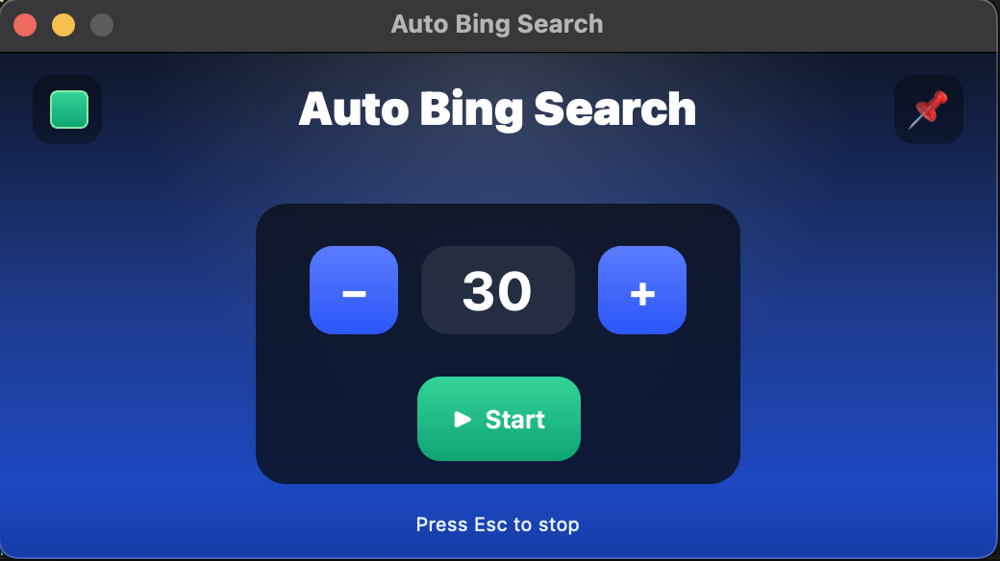

# Auto Bing Search

A tiny cross-platform desktop app that opens your browser and runs a series of Bing searches using a curated word list. Built with **PySide6** and a minimal, modern UI.

  

---

## Highlights

* **Start → 5-second countdown → search loop** (10s between searches).
* **Start / Pause / Stop** controls with state-aware buttons.
* **Pin on top** toggle with visual highlight.
* **Remaining counter** appears when the run starts.
* **Global stop hotkey** (works unfocused once permissions are granted):

  * **macOS:** `Esc` (native event tap; falls back to AppKit/pynput).
  * **Windows:** `Ctrl+Alt+S` — system hotkey with two fallbacks.
  * **Linux:** `Esc` via `pynput`.
* **Focus recovery**: before every search the app refocuses the browser window.
* **Search box first, address bar if needed**: types into Bing’s on-page box; if that can’t be focused, it focuses the address bar and types the query like normal text.
* **Edge preference** (falls back to default browser).
* **Permissions quick-open on macOS**: hold **Option** and click **Start** to open the helper any time.
* **Single file** distribution on Windows & Linux; **Universal 2** app on macOS.

---

## How it works (per OS)

* **macOS**

  * Activates your browser, focuses Bing’s search box, types human-like, and presses Return.
  * If the box can’t be focused, it hits **Cmd+L**, types the query in the address bar, and presses Return.
  * On first launch, a one-time permissions helper appears with buttons for **Accessibility**, **Input Monitoring**, and **Automation**.
  * Need it again later? Hold **Option** and click **Start** to reopen the helper.

* **Windows**

  * Global stop: **Ctrl+Alt+S** (left keys recommended). Registered via `RegisterHotKey` with low-level and pynput fallbacks.
  * Types into Bing’s box; if that fails, uses **Ctrl+L** to type in the address bar and presses Enter.
  * The app attempts to bring a major browser (Edge/Chrome/Firefox/Brave/Opera) to the foreground before each search.

* **Linux**

  * Uses `pyautogui` for typing; `Esc` stops via `pynput`.
  * X11 recommended (Wayland may block automation). If available, `wmctrl`/`xdotool` help focusing the browser.
  * Falls back to **Ctrl+L** → address bar typing when the on-page box can’t be focused.

---

## Project layout
